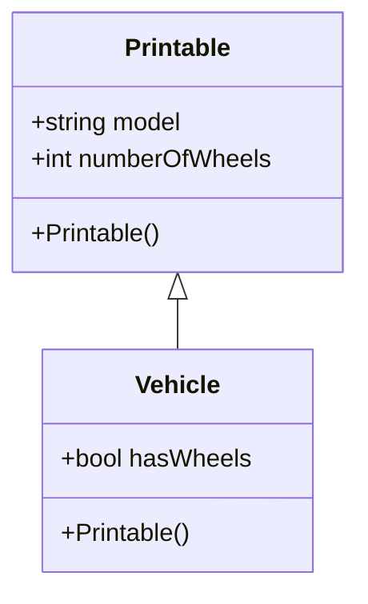
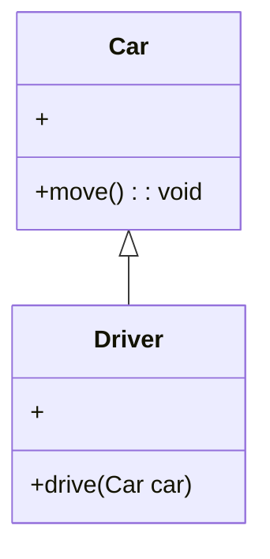
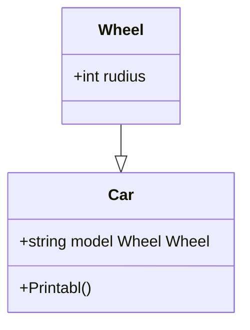
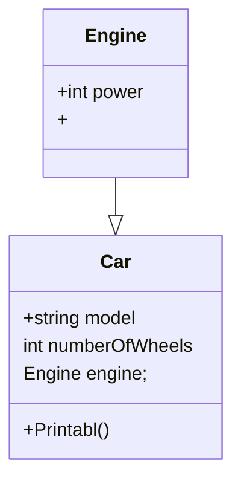
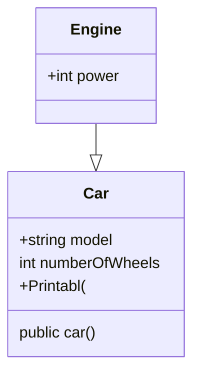
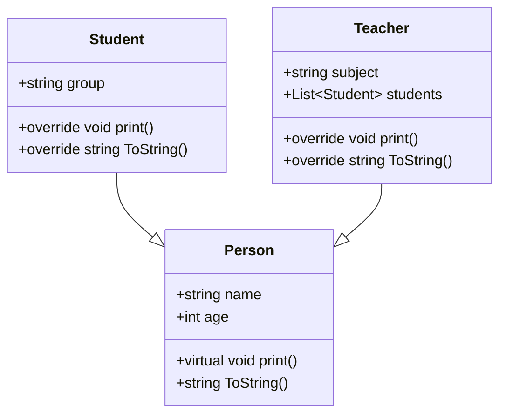
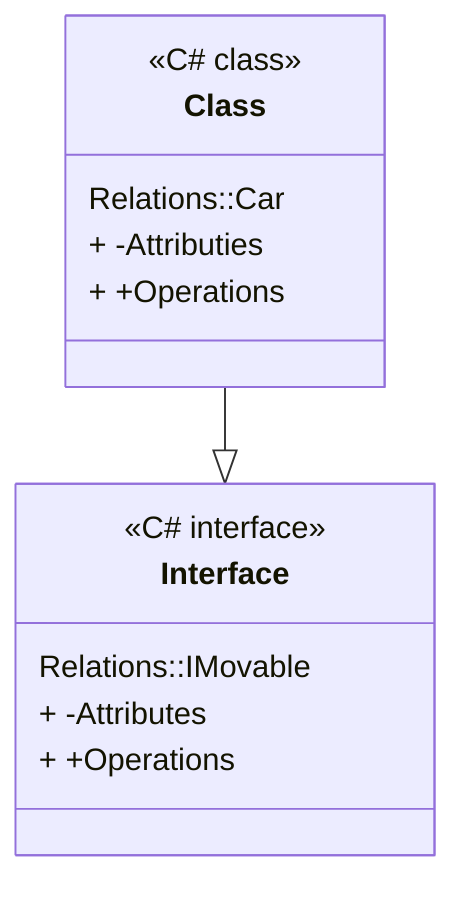

## Конструктор копирования
- Имя конструктора копирования должно совпадать с именем класса
- конструктор копирования требует наличия другого конструктора для копирования объекта
- Нет возвращаемого типа конструктора копирования
- Конструктор копирования не может быть закрытым, статическим и абстрактным

```csharp
class Demo
{
string name;
int age;
public Demo(string name, int age)
{
this.name = name;
this = age;
}
public Demo (Demo d)
{
this.name = d.name;
this.age = d.age;
}
Demo obj = new Demo("John", 20);
Demo obj1 = new Demo(obj);
}
```
## Первичные конструкторы и инициализаторы
Инициализаторы передают в () значений доступным полям и свойствам объекта:
Person tom = new Person {name = "Tom", age = 31}
Инициализировать можно только открытые поля и свойства, инициализатор выполняется после консrтруктора.

## Цепочка вызова конструкторов
```csharp
class Person
// 1 вариант
{public Person(){name = "Неизвестно"; age = 18;}
public Person(string n) {name =n; age = 18;}
public Person(string n, int a) {name = n; age =a;}
}
// 2 variant
public Person() :this("Незивестно"){}
public Person(string name) :this(name,18) {}
public Person(string name, int age)
{
```

Помимо массивов и массивов класса Array существуют отдельный класс стандартны коллекций к ним относят:
- списки(List)
- множества
- словари
- стек
- очередь
В отличие от класса Array  коллекции используют, только указанного типа.
Они могут автоматически саморасширяться, поэтому для переборов элементов в коллекции используется оператор foreach.

Индексатор - используются для перечисления элементов, которые можно перечислить, как элементы коллекции. Записываются 
```csharp
public bool this[Education index]
```
## Инкапсуляция
Еще один способ сокрытия данных - использование констант и полей, доступных только для чтения
```csharp
{public const double P1 = 3.14;}
class Program {static void Main{string[] args)
{Console.WriteLine("*****Fun with Const*****\n)"}}
Console.WriteLine("The value of Pi is: {0}", MyMathClass.P1)
MyMathClass P1 = 3.1444 // Error
Console.ReadLine();}}}
}
```
## Полиморфизм
Функции с одним и тем же именем соответствует разный программный код в зависимости от того, объект какого класса используется при вызову этой функции.

Полиморфизм - свойство системы использовать объекты с одинаковым интерфейсом без информации о типе и внутренней структуре объекта.

## Перегрузка методов
- Существует два типа полиморфизма:
	- время компиляции(перегрузка)
	- время исполнения(переопределение)
- При перегрузке есть несколько методов с одинаковым именем, но разными сигнатурами методов. Мы можем добиться перегрузки путем изменения:
	- количества параметров
	- порядка параметра
	- типов данных параметров
	- необязательные параметры
	- именованные аргументы
Сигнатура - информация о методе, имя передаваемое возвращаемое значение
```csharp
class Demo
{
public int Sum(int x, int y, int z)
{
int value = x + y + z;
return value;
}
public double Sum
}
```

## Перегрузка операций
`+ - ! ++ -- false true` набор унарных операций может быть перегружен
`+ - * / % & | ^ << >>` бинарные операции могут быть перегружены
`== != < > <= =>` Эти операции сравнения могут быть перегружены. C# требует совместной перегрузки "подобных" операций ( т.е < and >, <= and => и т.д.)
`[]` Операция не может быть перегружена. Однако, аналогичную функциональность предлагают индексаторы
`()` Операция не может быть перегружена. Однако ту же функциональность предоставляют специальные методы преобразования
`*=, /=, %=, &=, |=` Сокращенный операции присваивания не могут перегружаться; однако вы получаете их автоматически, перегружая соответствующую бинарную операцию

## Перегрузка операций
- Форма перегрузки унарной операции
```csharp
public static возвращаемый_тип operator op (тип_параметра операнд)
```
{// операторы}

- Форма перегрузки бинарной операции
```csharp
public static возвращаемый_тип operator op (тип_параметра1 операнд1, тип_параметра2 операнд2)
```

- Все методы, представляющие перегружаемые операторы, должны быть определены как public and static
- Формально возвращаемое^значение может быть любого типа. Однако общая практика - возвращать тип, для которого определяется метод
- Число передаваемых аргументов зависит от типа перегружаемого оператора. Для унарных операторов должен указываться один аргумент. Для перегрузки бинарного оператора передаются два аргумента
- В случае унарных операторов аргумент этого метода должен быть того же типа, что и включенный в него класс или структура.
- Если перегружается бинарный оператор, тип первого аргумента должен совпадать с типов вложенного класса, а второй может быть любого типа
## Позднее связывание
- Объект подкласса(потомка) может использоваться всюду, где используется обхект суперкласса(предка)
- При добавлении к иерархии классов нового подкласса не нужно менять написанный код
- Позднее связывание позволяет определить версию полиморфного мтеода во время выполнения программы


Наследование - может выполняться, только от одного класса или от интерфейса.
Синтаксис использование наследование
```csharp
public class Employee {.-.}
```

## Ключевое слово protected
Позволяет использовать функционал, только в потомках
## Ключевое слово sealed
Запрещает использовать потомков

## Виды наследования
- От простого класса
- от абстрактного класса
- Реализация интерфейса

## Взаимодействие между классами
- Наследование - класс-наследник имеет все поля и методы родительского класса и добавляет новый функционал
- Ассоциация - один класс включает в себя другой класс в качестве одно из полей
	- Композиция - используемый класс не существует отдельно от ключевого класса
	- Агрегация - экземпляр используемого класса создается где-то в другом месте кода, и передается в конструктор ключевого класса в качестве параметра
- Реализации - определение интерфейса и его реализации в классе
- Зависимость - метод одного класса, который принимает объект другого класса в качестве параметра

## Наследование (связь является)


```csharp
class Vehicle
{
bool hasWheels
}
class car : Vehicle
{
string model = "Porshe";
int numberWheels = 4;
public void Printabl(){}
}
```

Связь наследования позволяет использовать все поля и методы родительского класса, добавляя к ним свой функционал или переопределяют их.

## Зависимость

```csharp
public class Driver
{
public void drive (Car car)
{
car.move()
}
...
}
public class Car
{
public void move()
{
......,
}
}
```
Зависимость слабая связь между классами. Позволяет использовать экземпляры одного класса в параметрах методов в другом классе, тем самым позволяет вызвать методы


## Ассоциация



```csharp
class Wheel
{
int rudius
}
class Car
{
string model = "Porshe";
Wheel Wheel;
{get;set;}
}
```
## Композиция

```csharp
class Engine
{
int power;
public Engine(int p)
{
power = p;
}
}
class Car
{
string model = "Porshe";
Engine engine;
public Car()
{
this.engine = new Engine(360);
}
}
```

## Агрегация

```csharp
public class Engine
{
int power;
public Engine(int p)
{
power = p;
}
}
class Car
{
string model = "Porshe";
Engine engine;
public Car(Engine someEngine)

this.engine = someEngine;
}}
Engine goodEngine = new Engine(360);
Car porshe = new Car(goodEngine);
```
При агрегации реализуется слабая связь. В конструкторе Car() передается ссылка на уже существующий объект Engine. И, как правило, определяется ссылка не на конкретный класс, а на абстрактный или интерфейс, что увеличивает гибкость программы.


## Рекомендации при проектировании отношений между классами
- Вместо наследования следует предпочитать композицию
	- При наследовании весь функционал класса-наследника жестко определен на этапе компиляции. И во время выполнения программы мы не может его динамически определить. А класс-наследник не всегда может определить код, который определен в родительском классе. Композиция же позволяет динамически определять поведение объекта во время выполнения, поэтому является более гибкой
- Вместо композиции следует предпочитать агрегацию
	- Но не всегда агрегация уместна. Например, есть класс человека, который содержит объект нервной системы-голову. В реальности нельзя во вне определить голову и внедрить ее в человека. В данном случае и создание объектов и их жизненный цикл будет происходить совместно, поэтому здесь выбираем композицию

## Выводы
Не все члены базового класса наследуются производными классами. Следующие члены не наследуется.
- Статические конструкторы, которые инициализируют статические данные класса.
- Конструкторы экземпляров, которые вызываются для создания нового экземпляра класса. Каждый класс должен определять собственные конструкторы.
- Методы завершения, которые вызываются сборщиком мусора среды выполнения для уничтожения экземпляров класса.

## Доступность членов влияет на видимость для производных классов
- Закрытые члены являются видимыми только в производных классах, которые вложены в базовый класс. Для других производных классов они невидимы.
- Защищенный члены являются видимыми только в производных классах.
- Внутренние члены являются видимыми только в производных классах, которые находятся в той же сборке, что и базовый класс. Они не будут видимыми в производных классах, расположенных в других сборках.
- Открытые члены являются видимыми в производных классах, а также входят в общедоступный интерфейс производных классов. Унаследованные открытые члены можно вызывать так же, как если бы они были определены в самом производном классе
Наследование применяется только для классов и интерфейсов. Другие категории типов не поддерживают наследование.


## Преобразование типов

```csharp
Student st = new Student("Tom""Epi-2");
Person person = st;

object person1 = new Student("Tom","EPI");
object person2 = new Teacher("Bob", "OOP")l
object person3 = new Person("Sam");
```

## Ключевое слово as
программа пытается преобразовать выражения к определенному типу, при этом не выбрасывает исключение. В случае неудачного преобразования выражение будет содержать значение null:

```csharp
Person person = new Person("Tom");
Student? st = person as Student;
if(st == null)
{
Console.WriteLine("Преобразование прошло неудачно");
}
else
{
Console.WriteLine(st.Group);
}
```
## Ключевое слово is
Если значение от операторы представляет тип, указанный справа от операторы, то оператор is возвращает true, иначе возвращает false. Причем оператор is позволяет автоматически преобразовать значение к типу, если это значение представляет данный тип.

```csharp
Person person = new Person("Tom");
if(person is Student st)
{
Console.WriteLine(st.Group);
}
else
{
Console.WriteLine("Преобразование не допустимо");
}
```

## Полиморфизм
- Во время выполнения объекты производного класса могут обрабатываться как объекты базового класса в таких местах, как параметры метода и коллекции или массивы. Когда возникает полиморфизм, объявленный тип объекта перестает соответствовать своему типу во время выполнения
- Базовые классы могут определять и реализовывать виртуальные методы, а производные классы - переопределять их, т.е. представлять свое собственное определение и реализацию.

```csharp
class Base
{
protected virtual void Execute(){}
{
class Derived : Base
{
protected override void Execute()
{
Log("Before executing");
base.Execute();
Log("After executing");
}
private void Log(string message){/* some logging code */}
}
}
}
```

- virtual -позволяет классу-наследнику переопределить поведение метода с помощью override
- Для вызова метода базового класса используется слово base

## Правила переопределение метода
- Подпись метода производного класса должна совпадать с базовым классом.
- Переопределение невозможно в одном классе.
- Модификаторы  доступа должны быть одинаковыми для виртуальных методов и методов переопределения.
- Ключевое слово virtual используется в методе базового класса, а Override - в методе производного класса
- Метод базового класса не должен быть статическим

## Виртуальные члены
- Производный класс может переопределять виртуальные члены в базовом классе, определяя новое поведение.
- Производный класс наследует ближайший метод базового класса без его переопределения, сохраняя существующее поведение, но позволяя дальнейшим производным классам переопределять метод
- Производный класс может определить новую, не виртуальную реализацию тех членов, которые скрывают реализации базового класса

## Полиморфизм << для конкретного случая >> (ad hoc полиморфизм)
- Ad hoc полиморфизм позволяет обращаться схожим образом к объектам, не связанным классическим наследованием. Для этого в каждом из таких объектов должен быть метод с одинаковой сигнатурой.
- В этом случае применяется технология позднего связывания, когда тип объекта, к которому происходит обращение, становится ясен только в процессе выполнения программы.

## Абстрактные классы и члены классов
- Ключевое слово abstact позволяет создавать классы и члены классов, которые являются неполными и должны быть реализованы в производном классе
- Ключевое слово sealed позволяет предотваратить наследование класса или определенных членов класса, помеченных как virtual
- Кроме обычных методов абстрактный класс может содержать абстрактные методы. Такие методы определяются ключевым словом abstract и не имеют функционала

## Абстрактные классы
Особенности:
- Производный класс обязан переопределить и реализовать все абстрактные методы, которые имеются в базовом абстрактном классе
- Если класс имеет хотя бы один абстрактный метод то он должен определен как абстрактный
- Производный класс, в котором не будет замещен абстрактный метод сам считается абстрактным и мы не сможем создавать объекты этого класса


## Создание и использование базовых классов

```cs
abstract class Base
{
public virtual void MethodWithImplementation()
{/*Method with implementation*/}
public abstract void AbstractMethod();
}
class Derived : Base
{
public ovverride void AbstractMethod(){}
}
```

- abstract - класс, экземпляр которого не может быть создан
- abstract метод - должен быть переопределен в классе наследнике обязательно
- virtual - может иметь реализацию, но может быть переопределен в классе наследнике
- sealed - класс, которые не может иметь наследников и все методы должны быть определены

## Принцип подстановки Лискова
Наследование является мощной техникой, но ее следует использовать с осторожностью. Как уже упоминалось, наследование должно использовать только тогда, когда вы имеет дело с отношениями типа <<является>>. Принцип подстановки Лискова гласит, что подкласс должен использоваться в каждом месте, где вы можете использовать один из базовых классов. Они не должны внезапно менять поведение, от которого будут зависеть пользователи.


```cs
class Rectangle
{
	public Rectangle(int width, int height)
	{
	public int Weight ( get; set; )
	public int Width ( get; set; )
	public int Area
	}
	{
	get { return Weight * Width}
	}
	Rectangle rectangle = new Square();
	rectangle.Width = 1;
	rectangle. Height = 5;
}
```

## Сокрытие членов базового класса новыми членами
Если вы хотите, чтобы производный класс имел член с тем же именем, что и член в базовом классе, можно использовать ключевое слово new, чтобы скрыть член базового класса. Ключевое слово new вставляется перед типом возвращаемого значения замещаемого члена класса:

```cs
public class BaseClass
{
public void DoWork{} {WorkField++;}
public int WorkField;
public int WorkProperty
{
get {return 0}}
public class DerivedClass : BaseClass
{
public new void DoWork{}
{WorkField++;}
public new int WorkField;
public new int WorkProperty
{get {return 0;}}
}
}
}
```
## Сокрытие членов базового класса новыми членами
Производный класс, который заменил или переопределил метод или свойство, может получить доступ к методу или свойству на базовом классе с помощью ключевого слова base.

```cs
public class Base
{
public virtual void DoWork(){/*...*/}
}
public class Derived : Base
{
public override void DoWork()
}
```
Если реализация базового класса не вызывается, производный класс сопоставляет свое поведение с поведением базового класса по своему усмотрению


Если метод в классе именован, с вызовом совместимы сразу несколько методов, а параметры совместимы с переданным параметром, компилятор С# выбирает метод, наиболее подходящий для вызова
```cs
public class Derived : Base
{
public override void DoWork(int param){ }
public void DoWork(double param){ }
}
int val = 5;
Derived d = new Derived();
d.DoWork(val);
((Base)d).DoWork(val)
```

### Example
```cs
class BaseClass
{
public void Method1()
{
Console.WriteLine("Base - Method1");
}
}

class DerivedClass : BaseClass
{
public void Method2()
{
public void Method2()
{
Console.WriteLine("Derived - Method2");
}
}
}

class Program
{
static void Main(strin[] args)
{
BaseClass bc = new BaseClass();
DerivedClass dc = new DerivedClass();
BaseClass bcdc = new DerrivedClass();

bc.Method1();
dc.Method1();
dc.Method2();
bcdc.Method1();
}
}
```

## Интерфейсы
- Интерфейс подобен абстрактному базовому классу. Любой класс, реализующий интерфейс, должен реализовывать все его члены.
- Невозможно создать экземпляр интерфейса напрямую. Его члены реализуются любым классом, реализующий интерфейс.
- Интерфейсы могут содержать методы, свойства, события, индексаторы, статические поля и константы. Интерфейс не может содержать поля экземпляров, конструкторы. Члены интерфейса по умолчанию являются открытыми.
- Интерфейсы поддерживают реализацию методов и свойств по умолчанию
- Класс или структура может реализовывать несколько интерфейсов, но класс может наследовать только от одного класса.
- Если базовый класс реализует интерфейс, то любой класс, производный от базового класса, наследует эту информацию
Интерфейс реализует инкапсуляцию, наследование (множественное) и полиморфизм(методы переопредляются)

```cs
interface IMovable
{
void Move();
}
class Person : IMovable
{
public void Move()
{
Console.WriteLine("Человек идет");
}
}
struct car : IMovable
{
public void Move()
{
Console.WriteLine("Машина едет");
}
Person person = new Person();
Car car = new Car();
person.Move();
car.Move();
}
```

## Дизайн и реализация интерфейсов

```cs
interface IAnimal
{
void Move();
}
class Dog : Animal
{
public void Move(){}
public void Bark(){}
}
IAnimal animal = new Dog();
Void  MoveAnimal(IAnimal animal)
{
animal.Move();
}
```

- При наследовании от интерфейса можно создавать класс и присваивать значение переменной с типом интерфейса.
- Если потребуется метод, то можно его просто привести к нужному типу
- Интерфейс может использоваться как тип параметра в методе.
- Интерфейс гарантирует реализацию классом согласованного контракта

## Отношение между классами. Реализация.

```cs
public interface IMovable
{
void Move();
}
public class car : IMovable
{
public void Move()
}
{
Console.WriteLine("Машина едет");
}
}
```




## Интерфейсы в преобразованиях типов

```cs
class Message : IMessage, IPrintable
// Все объекты Message являются объектами IMessage
IMessage hello = new Message("Hello");
Console.WriteLine(hello.Text);
//Не все объекты IMessage являются объектами Message,
Message someMessage = hello; // !Error
// Интерфейс IMessage не имеет свойства Print
hello.Print(); // Error
if (hello is Message someMessage) someMessage.Print();
```
Преобразование от класса к его интерфейсу, как и преобразование от производного типа к базовому, выполняется автоматически

- Обратное преобразование - от интерфейса к реализующему его классу будет аналогично преобразованию от базового класса к производному
- Так как не каждый объект IMessage является объектом Message (ведь интерфейс IMessage могут реализовать и другие классы), то для подобного преобразованиея необходима операция приведения типов. И если мы хотим обратиться к методам класса Message, которые не определены в интерфейсе IMessage, но являются частью класса Message, то нам надо явным образом выполнить преобразование типов

## Реализация по умолчанию для метода интерфейса

```cs
public interface IControl
{
void Paint() => Console.WriteLine("Defaul Paint method"); 
}
public class SampleClass : IControl
{// Paint() is inherited from IControl}

var sample = new SampleClass();
var control = sample as IControl;
control Paint();
```

Любой класс, реализующий интерфейс IControl может переопределить метод Paint по умолчанию либо в качестве открытого метода, либо в качестве реализации интерфейса

## Явная реализации интерфейса

Явная реализация интерфейса также применяется в случаях, когда в каждом из двух интерфейсов объявляются разные члены (например, свойство и метод) с одинаковыми именами

## Сокрытие метода в производном классе
### Наследование интерфейсов
Можно выполнять наследование интерфейсов друг от друга, тогда класс, который реализует потомка интерфейса должен реализовать методы и базового класса
```cs
Interface IAction
{
void Move()
}
interface IRunAction : IAction
{
void Run()
}
class BaseAction :: IRunAction
{
public void Move()
{
Console.WriteLine("Move");
}
public void Run()
{
Console.WriteLine("Run")}

}
```


## Методы расширения
- Методы расширений позволяют добавлять новые методы в уже существующие типы без создания нового производного класса. Эта функциональность бывает особенно полезна, когда необходимо добавить в некоторый тип новый метод, но сам тип мы изменить не можем поскольку у нас нет доступа к исходному коду. Либо если мы не можем использовать стандартный механизм наследования, например, если классы определенны с модификатором sealed
1. Создать статический класс, который будет содержать требуемый метод
2. Объявить статический метод
Метод расширения -обычный статический метод, который в качестве первого параметра всегда принимает конструкцию
```cs
this имя_типа название параметра
```
Метод расширения никогда не будет вызван, если он имеет ту же сигнатуру , что и метод, изначально, определенный в типе
Методы расширения действуют на уровне пространства имен

## Частичные классы
```cs
public partial class Person
{
public void Move(){
Console.WriteLine("Человек идет");
}
public partial class Person
{
public void Eat(){
Console.WriteLine("Человек есть");
}
}
}
```

Частичные классы необязательно надо размещать в разных файлах. Они могут помещаться и в один и тот же файл и даже быть размещены рядом.


По умлочанию к частичным методам применяется ряд ограничений:
- Они не могут иметь модификаторы доступа
- Они имеют тип void
- Они не. могут иметь out-параметры
- Они не могут иметь модификаторы virtual, override, sealed, new или extern
Если же они не соответствуют какому-то из этих ограничений, то для них должна быть предоставлена реализация
Частичными могут быть свойства и индексаторы

## Дизайн классов
1. Принципы SOLID
	- Single responsibility principle ( принцип единственной ответственности)
	- Open/closed principle (Принцип открытости/закрытости)
	- Liskov substitution principle (Принцип подстановки Барбары Лисков)
	- Interface segregation principle (принцип разделения интерфейсов)
	- Dependency Inversion principle (принцип инверсии зависимостей)
2. Сильное сцепление
3. Слабая связность

## Принцип единственной ответственности
- Каждый класс имеет свои обязанности в программе
- Если у класса есть несколько обязанностей, то у него появляется несколько причини для изменения
- Изменение одной обязанности может привести к тому, что класс перестанет справляться с другими
- Такого рода связанность - причина хрупкого дизайна, который неожиданным образом разрушается при изменении
- Хорошее разделение обязанностей выполняется только тогда, когда имеется полная картина того, как приложение должно работать

## Принцип открытости/закрытости
- Классы, методы или функции должны быть открыты для расширения и закрыты для модификаций

## Принцип подстановки Барбары Лисков
- Подтипы должны быть заменяемыми для супертипа. Другими словами, методы или функции, работающие с суперклассом, должны иметь возможность без проблем работать также и с его подклассами
- Если класс реализует большие функциональности, чем подкласс, то последний может не поддерживать некоторые функции и тем самым нарушает данный принцип

## Принцип разделения интерфейса
- Интерфейс который не используется, не должен быть реализован
- В основном это происходит, когда один интерфейс содержит несколько функциональностей, и клиенту нужна только одна из них, а другие - нет

## Принцип инверсии зависимостей
- Любой класс легко тестируется с помощью фиктивного объекта и проще в обслуживании, потому что код создания объекта централизован, а клиентский код не перегружен им


 