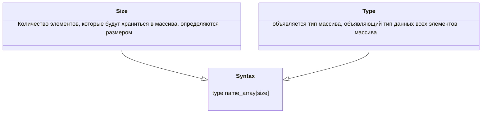
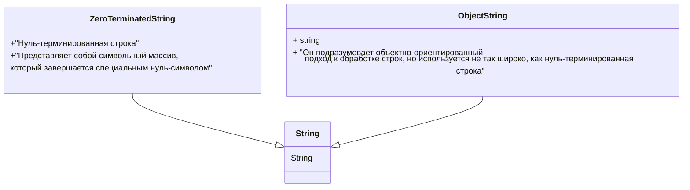

Массив - коллекция переменных одинакового типа.
Бывают: 
- одномерные
- многомерные
Указатель - объект, содержащий адрес памяти. Обычно он используется для доступа к значению другого объекта.

## 4.1 Одномерные массивы

Одномерный массив - список связанных переменных.
Для объявления массива используется такой синтаксис:

```
type name_array[size]
```

###### Пример:
```cpp
int sample[10]
```

```
Здесь мы объявили целочисленный массив состоящий из 10 чисел и присвоили ему имя Sample
```


Доступ к отдельному элементу массива осуществляется с помощью индекса.
Индекс - отражает позицию элемента внутри массива.
В С++ первый элемент массива имеет индекс [0].
Чтобы получить доступ к элементу массива, достаточно указать его индекс в []. 
Т.е. чтобы обратиться к первому элементу массива Sample, нужно написать

```cpp
sample[0]
```

А для последнего:

```cpp
sample[9]
```

Пример программы, в ней программа помещает в массив array числа от 0 до 9:
```cpp
[[include]] <iostream>  
  
using namespace std;  
  
int main() {  
    int array[10];  
    int t;  
  
    for (t = 0; t < 10; t++) {  
        array[t] = t;  
        cout << "This array" << "[" << t << "]" << array[t] << endl;  
    }  
  
    return 0;  
}

```
```вывод в консоли:
This array[0]0
This array[1]1
This array[2]2
This array[3]3
This array[4]4
This array[5]5
This array[6]6
This array[7]7
This array[8]8
This array[9]9
```

В языке С++ массивы состоят из смежных ячеек памяти. Ячейка с наименьшим адресом относится к первому элементу массива, а с наибольшим - к последнему

``Пример с массивом``

```cpp
[[include]] <iostream>  
  
using namespace std;  
  
int main() {  
    int i;  
    int avg;  
    int min;  
    int max;  
    int sum = 0;  
    int nums[10];  
    nums[0] = 10;  
    nums[1] = 18;  
    nums[2] = 75;  
    nums[3] = 0;  
    nums[4] = 1;  
    nums[5] = 56;  
    nums[6] = 100;  
    nums[7] = 12;  
    nums[8] = -19;  
    nums[9] = 88;  
  
    for (i = 0; i < 10; i++) {  
        sum += nums[i];  
        avg = sum / 10;  
    }  
    min = max = nums[0];  
    for (i = 1; i < 10; i++) {  
        if (nums[i] < min) {  
            min = nums[i];  
        }  
        if (nums[i] > max) {  
            max = nums[i];  
        }  
    }  
    cout << "average = " << avg << endl;  
    cout << "MIN = " << min << endl;  
    cout << "MAX = " << max << endl;  
}
```
```
вывод консоли
average = 34
MIN = -19
MAX = 100
```

При использовании массивов нужно иметь в виду одно очень важное ограничение. В языке С++ нельзя присвоить один массив другому. 
В следующем фрагменте кода, например, показанное присваивание недопустимо:
```cpp
ant a[10], b[10]
//...
a = b // ошибка недопустимо
```

Чтобы поместить содержимое одного массива в другой, необходимо отдельно выполнить присваивание каждого значения.

Ниже показан пример:
```cpp
for(i = 0; i < 10; i ++){
a[i] = a[b]
}
```


### Проверка границ массива
В языке С++ не выполняется никакой проверки нарушения границ массивов, т.е. ничего не мешает программисту обратиться к массиву за его пределами.

Компилятор С++ скомпилирует и запустит показанный ниже код:

```cpp
[[include]] <iostream>  
  
using namespace std;  
  
int main() {  
    int crash[10];  
    int i;  
  
    for (i = 0; i < 100; i++) {  
        crash[i] = i;  
    }  
    return 0;  
}
```
```
вывод консоли
Process finished with exit code 134 (interrupted by signal 6:SIGABRT)
```
Здесь цикл for выполнит 100 итераций, хотя массив предназначен для хранения лишь 10 элементов.

Какие могут возникнуть проблемы:
- Перезапись важной информации, что может привести к аварийному завершению работы
- Могу быть изменены значения в ячейках памяти
- Вывести программу из строя

### 4.2 Двумерные массивы
Представляет собой список одномерных массивов.

Чтобы объявить двумерный массив целочисленных значений размером $10 X 20$ с именем twoD, достаточно записать следующее:

```cpp
int twoD[10][20];
```

Чтобы получить доступ к элементу массива twoD координатами 3,5, необходимо использовать запись:

```cpp
twoD[3][5];
```

В следующем фрагменте кода в двумерный массив помещаются последовательные числа от 1 до 12:

```cpp
[[include]] <iostream>  
  
using namespace std;  
  
int main() {  
    int t;  
    int i;  
    int nums[3][4];  
  
    for (t = 0; t < 3; t++) {  
        for (i = 0; i < 4; i++) {  
            nums[t][i] = (t * 4) + i + 1;  
            cout << "Nums[" << t << "][" << i << "]:" << nums[t][i] << " " << endl;  
        }  
    }  
    return 0;  
}
```
```
вывод консоли:
Nums[0][0]:1 
Nums[0][1]:2 
Nums[0][2]:3 
Nums[0][3]:4 
Nums[1][0]:5 
Nums[1][1]:6 
Nums[1][2]:7 
Nums[1][3]:8 
Nums[2][0]:9 
Nums[2][1]:10 
Nums[2][2]:11 
Nums[2][3]:12 
```
Схематически этот массив можно представить так:


|                  | ==0== | ==1== | ==2== | ==3== | Правый индекс |
| ---------------: | :---: | :---: | :---: | :---: | ------------- |
|            ==0== |   1   |   2   |   3   |   4   |               |
|            ==1== |   5   |   6   | ==7== |   8   |               |
|            ==2== |   9   |  10   |  11   |  12   |               |
| левый **индекс** |       |       |       |       |               |
Допустим нам нужен элемент на позиции
```cpp
[1][2]
```
это элемент 7


Место хранения для всех элементов массива определяется во время компиляции. Помимо этого, память, выделенная для массива, используется в течение всего времени его существования.
Чтобы определить количество байтов, необходимых для хранения массива, используем формулу:
$\text{Число байтов} = \text{число строк} \times \text{число столбцов} \times \text{размер типа в байтах}$.


### Многомерные массивы
В С++, помимо двумерных, можно определять массивы трех и более измерений.

Объявление многомерного массива:
```cpp
type name_array[size1][size2][size3]...[sizeN];

int multidim[4][10][3];
```


## Строки
В С++ поддерживаются два типа строк.

## Основы представления строк
Объявляя символьный массив, предназначенный для хранения нуль-терминированной строки, необходимо учитывать признак ее завершения и задавать длину массива на единицу больше длины самой большой строки из тех, которые предполагается в нем хранить.

Например, при объявлении массива str, в который предполагается поместить 10-символьную строку, нужно использовать следующий код:

```cpp
char str[11]
```
Заданный здесь размер [11] позволяет зарезервировать место для нуль-символа в конце строки.

Не нужно вручную добавлять в конец строковых констант нуль-символы. Компилятор С++ делает это автоматически. => строка Mars в памяти размещается так:

|  M  |  a  |  r  |  s  |  0  |
|:---:|:---:|:---:|:---:|:---:|
Строка приведенная последней называется нулевой. Такие строки состоят только из нуль символа(признака завершения) и используются для представления пустых строк


## Считывание строк с клавиатуры

Проще всего считать строку с клавиатуры, создав, массив типа char, который примет эту строку с помощью инструкции cin.  

Программа:
```cpp
[[include]] <iostream>  

using namespace std;  
  
int main() {  
    char ch[80];  

    cout << "Enter a string: ";  
    cin >> ch;  

    cout << "This your string: "<< ch << endl;  
  
    return 0;  
}
```
```
Вывод компилятора:

Enter a string: Hello World
This your string: Hello
```


При выводе строки, введенной с клавиатуры, программа отображает только слово Hello.  Дело в том что


## Строки
Для того чтобы строка выводила строку с пробелами используем библиотечную функцию gets(name_array)

## Некоторые библиотечные функции обработки строк

1. strcpy()
- Синтаксис вызова функции выглядит так:
  ```cpp
 strcpy(в, из)
```
Функция копирует содержимое строки из в строку в. Помните, что массив используемый для хранения строи в, должен быть достаточно большим, чтобы в него можно было поместить строку из массива из
2. strcat()
- Обращение к функции имеет следующий синтаксис:
```cpp
strcat(строка_1, строка_2)
```
Функция присоединяет строку_2 к концу строки_1, при этом строка_2 не изменяется. Обе строки должны завершаться нуль-символом, также как и результат вызова strcat().
3. strcmp()
- Обращение к функции имеет синтаксис:
```cpp
strcmp(строка_1, строка_2)
```
Функция сравнивает строку_2 со строкой_1 и возвращает значение 0, если они равны. Если строка_1 лексикографически больше строки_2, то возвращается положительное число, а если меньше-отрицательное.
При использовании функции важно помнить, что она возвращает число 0(т.е. значение false), если сравниваемые строки равны. Поэтому если вам нужно выполнить определенные действия при условии совпадения строк, вы должны использовать операцию !. К примеру, условие, управляющее следующей инструкцией if, даст истинный результат, если строка str содержит значение С++
```cpp
if(!strcmp(str, "C++")){
cout << "str is C++";
}
```
4. strlen()
- Синтаксис вызова функции выглядит так:
```cpp
strlen(строка)
```
Функция возвращает длину строки, указанной в качестве аргумента